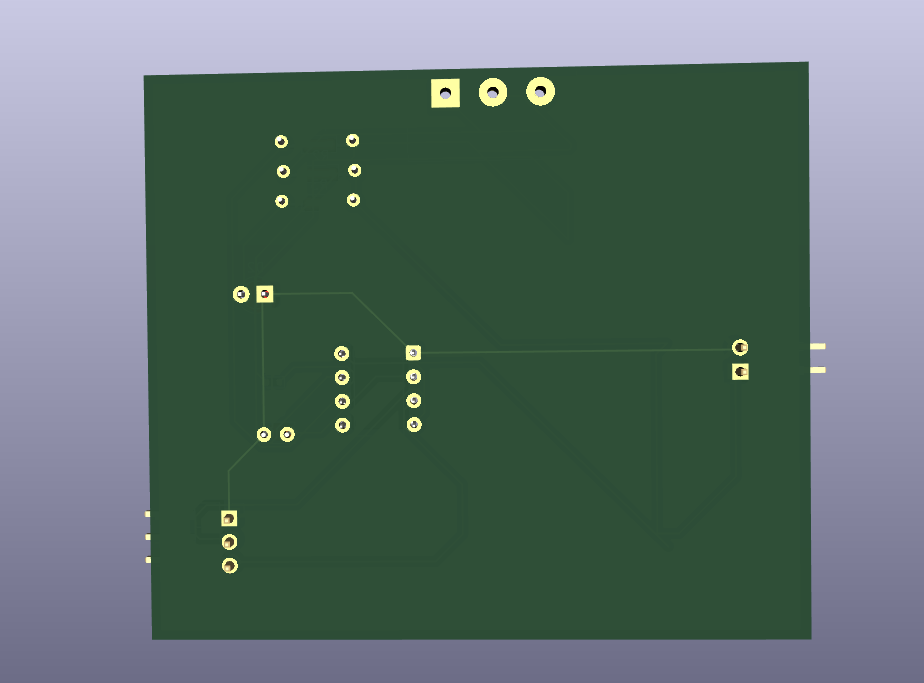

# 🔌 Transformerless Power Supply PCB (2-Layer Design)

A compact, cost-effective **transformerless AC-DC power supply** PCB, designed on a **2-layer board**, ideal for low-power embedded systems or IoT applications. This design eliminates bulky transformers using capacitive dropper topology.

---

## ⚙️ Features

- 🧩 **Transformerless AC to DC Conversion**
- 🌐 **Input Voltage**: 230V AC (mains)
- ⚡ **Output Voltage**: 12V DC (based on design)
- 🔄 **Capacitive Dropper Circuit**
- 🧯 Overvoltage and short-circuit protection
- 🖨️ **2-Layer PCB** for easy fabrication
- 🔬 Designed using **KiCad** / *(change if EasyEDA, etc.)*

---

## 📁 Project Files

| File/Folder        | Description                                  |
|--------------------|----------------------------------------------|
| `*.powerwithouttrans.kicad_prl`      | KiCad project file                           |
| `*.powerwithouttrans_pcb`            | PCB layout                                   |
| `*.kicad_sch`                        | Circuit schematic                            |
| `images/`                            | PCB renders and layout screenshots           |
| `README.md`                          | This documentation                           |
| `LICENSE`                            | Open source license (e.g., MIT or CERN-OHL)  |

---

## 🧠 Circuit Description

This power supply utilizes an **X-rated safety capacitor** to drop mains AC voltage, followed by:
- **Bridge rectifier** for AC to DC conversion
- **Zener diode** or **regulator IC** for voltage stabilization
- **Snubber network & fuse** for protection

⚠️ **Caution**: This is a **non-isolated** design and must be used with care. Do not touch the circuit while it's powered. Suitable for **low-current, enclosed applications only**.

---

## 🖼️ PCB Layout & 3D View

| Top View | Bottom View |
|----------|-------------|
|  |  |

---

---

## 📝 License

This project is licensed under the **MIT License**. See the `LICENSE` file for more information.

---

## 🤝 Contributing

Contributions are welcome! Feel free to fork this repository, make enhancements, and submit a pull request.

---

## 📬 Contact

For questions or collaboration:
- ✉️ Email: `youremail@example.com`
- 🌐 GitHub: [YourUsername](https://github.com/YourUsername)

---

> ⚠️ **Disclaimer**: This project involves direct mains voltage. Only qualified individuals should handle or modify the circuit. The creator is not responsible for any damage or injury caused by misuse.
